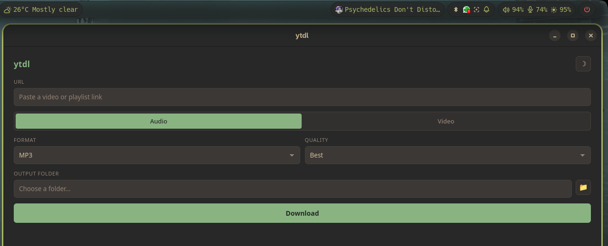

<p align="center">
  
</p>

<h1 align="center">Youtube Simple Downloader</h1>

<p align="center">
  A minimal, modern desktop GUI to download YouTube videos and playlists as
  audio or video — built with <a href="https://tauri.app">Tauri</a> and
  powered by <a href="https://github.com/yt-dlp/yt-dlp">yt-dlp</a>.
</p>

<p align="center">
  <a href="https://github.com/chevalierjvps/Youtube-Simple-Downloader/actions/workflows/release.yml"></a>
  <a href="https://github.com/chevalierjvps/Youtube-Simple-Downloader/releases/latest"></a>
  <a href="LICENSE"></a>
  
  
</p>

<p align="center">
  
</p>

## Features

- 🎵 Audio (mp3/m4a/opus/flac/wav) or 🎬 video (mp4/mkv/webm) downloads
- Quality selection for both audio and video
- Highest-quality thumbnail embedded as cover art + metadata for audio
- Native folder picker for choosing where files are saved
- Automatic playlist detection, with a choice to grab the whole playlist or
  just the current video
- Live progress bar (title, percentage, speed, ETA)
- 🎨 Gruvbox Material theme, dark and light, toggle in the top bar
- No telemetry, no bundled ads, no accounts — just a thin GUI over yt-dlp

## Requirements (to run)

The app itself is a small native binary, but it shells out to `yt-dlp` for
the actual downloading, so both of these need to be installed and on your
`PATH`:

- [yt-dlp](https://github.com/yt-dlp/yt-dlp)
- [ffmpeg](https://ffmpeg.org/download.html)

If either is missing, the app shows a warning banner on startup with
instructions.

## Download

Grab the latest build from the [**Releases**](https://github.com/chevalierjvps/Youtube-Simple-Downloader/releases/latest) page:

| Platform | Portable | Installer |
| --- | --- | --- |
| 🪟 Windows | `*_x64-setup.exe` runs standalone, no install needed | `*_x64_en-US.msi` |
| 🐧 Linux | `*.AppImage` — `chmod +x`, then run | `*.deb` / `*.rpm` |

## Building from source

Requirements: [Node.js](https://nodejs.org) 18+, [Rust](https://rustup.rs),
and the platform dependencies from the
[Tauri prerequisites guide](https://v2.tauri.app/start/prerequisites/)
(on Linux this is mainly `webkit2gtk`).

```bash
git clone https://github.com/chevalierjvps/Youtube-Simple-Downloader.git
cd Youtube-Simple-Downloader
npm install
npm run tauri dev    # run in development
npm run tauri build  # produce portable binary + installer for your OS
```

`tauri build` produces both the portable executable and the installer
package(s) for whichever OS you build on. Pushing a `v*.*.*` tag triggers
[`.github/workflows/release.yml`](.github/workflows/release.yml), which
builds both Windows and Linux packages in CI and attaches them to a GitHub
release automatically.

## How it works

The Rust backend spawns `yt-dlp` as a subprocess with a custom
`--progress-template`, parses its output live, and streams progress events
to the UI. The folder picker uses Tauri's native dialog plugin. The frontend
is plain HTML/CSS/JS — no framework, no bundler — kept intentionally small.

## License

[MIT](LICENSE)

---

<p align="center"><sub>by <strong>Jvps</strong></sub></p>
